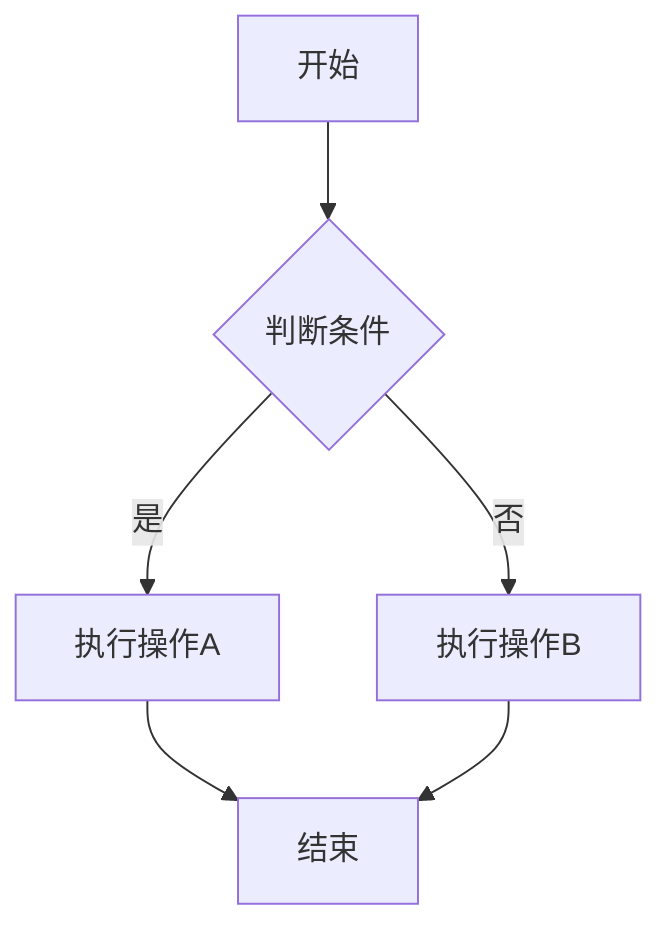
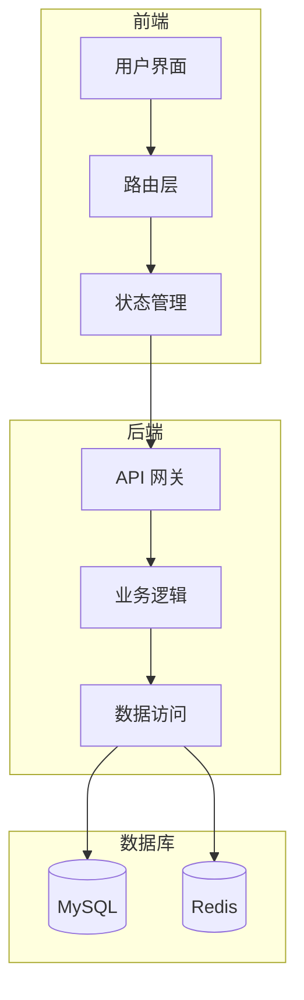
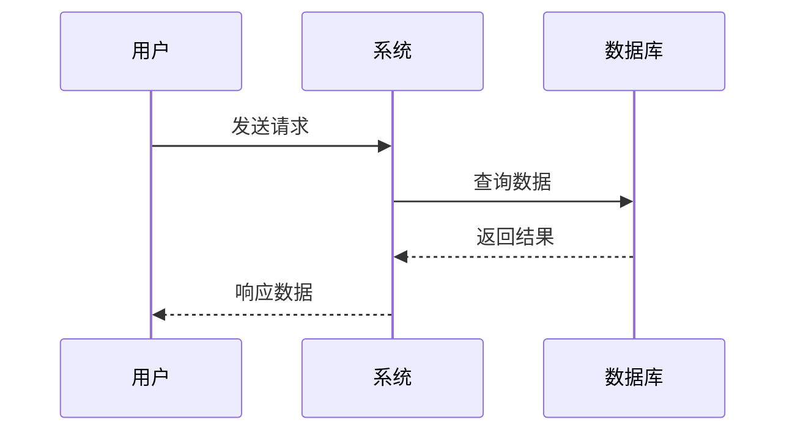
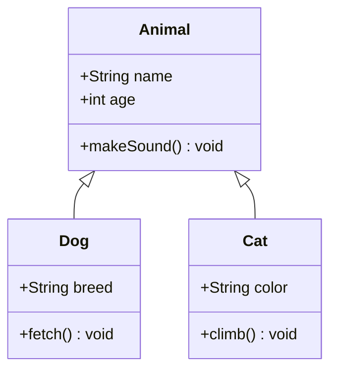
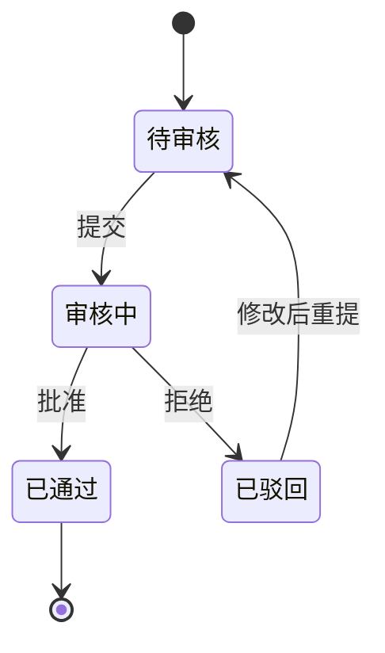
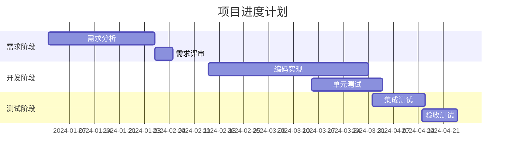
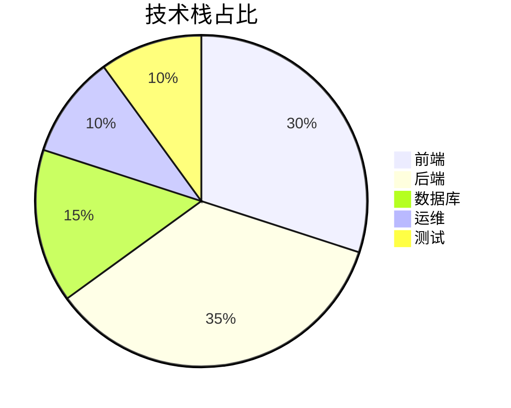
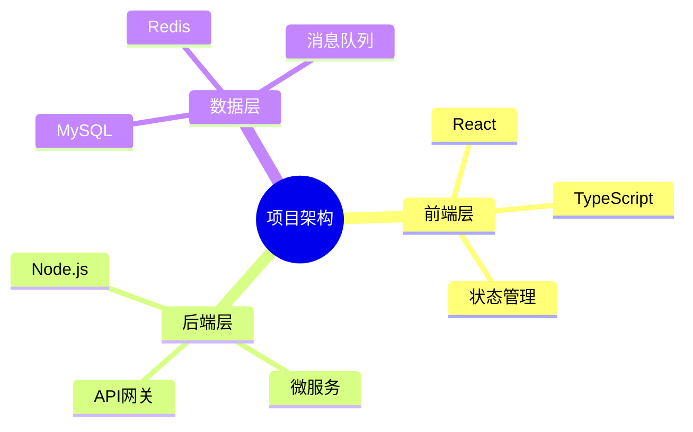
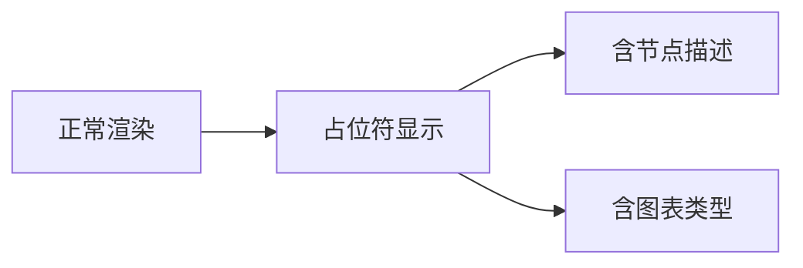
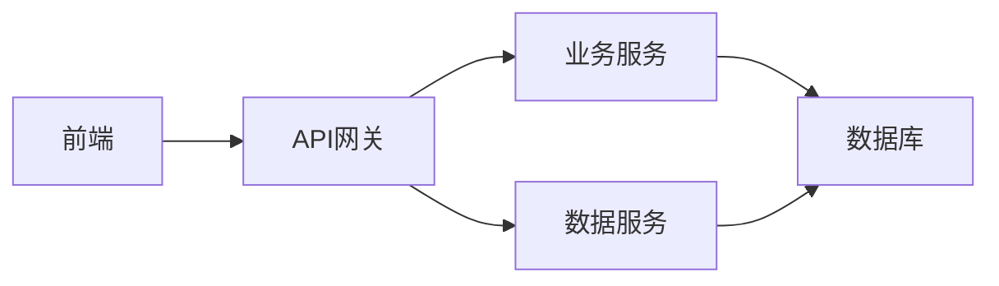

# Markdown to PPT 功能测试文档

## 1. 基础格式测试

### 1.1 内联格式

这是一段包含 **加粗文本**、*斜体文本*、***加粗斜体*** 和 `行内代码` 的测试段落。

### 1.2 转义字符

这里测试转义：\*不是斜体\*，\`不是代码\`，\[不是链接\]

### 1.3 中英文混排

This is English text mixed with 中文文本，用于测试 CJK 字符的处理和宽度计算。

### 1.4 Markdown 链接处理

#### 文本中的链接

这是一段包含链接的文本，请访问 [Google](https://www.google.com) 了解更多信息。

#### 列表中的链接

- 访问 [GitHub](https://github.com) 查看代码仓库
- 阅读 [文档](https://docs.example.com) 获取详细说明
- 下载 [安装包](https://example.com/download) 进行安装

#### 表格中的链接

| 资源名称 | 链接 | 说明 |
|---------|------|------|
| GitHub | [GitHub](https://github.com) | 代码托管 |
| Docker | [Docker Hub](https://hub.docker.com) | 镜像仓库 |
| npm | [npm](https://www.npmjs.com) | 包管理 |

### 1.5 超长单词

Thisisaverylongwordwithoutanyspacestotestthewrappingfunctionality

---

## 2. 列表测试

### 2.1 无序列表

- 第一级列表项 1
- 第一级列表项 2
   - 第二级列表项 2.1
   - 第二级列表项 2.2
- 第一级列表项 3

### 2.2 有序列表

1. 编号列表项 1
2. 编号列表项 2
3. 编号列表项 3
   - 混合嵌套项 3.1
   - 混合嵌套项 3.2

### 2.3 大量短列表（分页测试）

- 项1
- 项2
- 项3
- 项4
- 项5
- 项6
- 项7
- 项8
- 项9
- 项10
- 项11
- 项12
- 项13
- 项14
- 项15
- 项16
- 项17
- 项18
- 项19
- 项20
- 项21
- 项22
- 项23
- 项24
- 项25
- 项26
- 项27
- 项28
- 项29
- 项30
- 项31
- 项32
- 项33
- 项34
- 项35
- 项36
- 项37
- 项38
- 项39
- 项40
- 项41
- 项42
- 项43
- 项44
- 项45

> 45个短列表项应能够正常分页显示（超过单页33项限制）。

---

## 3. 标题层级测试

### 3.1 三级标题示例

#### 3.1.1 四级标题

这是四级标题下的内容。

##### 3.1.1.1 五级标题

这是五级标题下的内容，用于测试深层嵌套。

### 3.2 空内容过滤

#### 仅有标题的幻灯片

> 当一个幻灯片只有标题没有内容时，应被过滤掉避免空白页。

### 3.3 独立的二级标题

> 此标题下方若有内容会显示，无内容时不应产生空白幻灯片。

### 3.4 无内容的封面

关于此功能更详细的说明，请参考相关技术文档。这是一段普通的说明文本，用于验证基本文本渲染功能。

---

## 4. 代码块测试

### 4.1 Python 代码

```python
def calculate_sum(a, b):
    """计算两个数的和"""
    result = a + b
    return result

# 测试函数
print(calculate_sum(10, 20))
```

### 4.2 JavaScript 代码

```javascript
function greet(name) {
    return `Hello, ${name}!`;
}

console.log(greet("World"));
```

### 4.3 HTML 代码

```html
<!DOCTYPE html>
<html>
<head>
    <title>示例页面</title>
    <style>
        body { font-family: sans-serif; }
    </style>
</head>
<body>
    <h1>Hello World</h1>
</body>
</html>
```

### 4.4 SQL 代码

```sql
SELECT u.name, o.order_id, o.total_amount
FROM users u
JOIN orders o ON u.id = o.user_id
WHERE o.status = 'completed'
  AND o.created_at >= '2024-01-01'
ORDER BY o.total_amount DESC
LIMIT 10;
```

### 4.5 JSON 代码

```json
{
    "appName": "md-to-ppt",
    "version": "1.0.0",
    "dependencies": {
        "pptxgenjs": "^3.12.0",
        "mathjax-full": "^3.2.0"
    },
    "options": {
        "layout": "portrait",
        "font": "微软雅黑"
    }
}
```

### 4.6 代码块超长截断

#### 超过10行的代码块

```python
# 第1行：这是一个超过10行的长代码块，用于测试截断逻辑
line1 = "第1行"
line2 = "第2行"
line3 = "第3行"
line4 = "第4行"
line5 = "第5行"
line6 = "第6行"
line7 = "第7行"
line8 = "第8行"
line9 = "第9行"
line10 = "第10行"
line11 = "第11行（应被截断）"
line12 = "第12行（应被截断）"
```

#### 刚好10行的代码块（边界测试）

```python
def func1(): pass
def func2(): pass
def func3(): pass
def func4(): pass
def func5(): pass
def func6(): pass
def func7(): pass
def func8(): pass
def func9(): pass
def func10(): pass
```

---

## 5. 表格测试

### 5.1 简单表格

| 参数名称 | 类型 | 说明 |
|---------|------|------|
| input | String | 输入文件路径 |
| output | String | 输出文件路径 |
| layout | String | 布局类型 |

### 5.2 复杂表格

| 功能模块 | 实现状态 | 优先级 | 负责人 |
|---------|---------|--------|--------|
| 配置管理 | 已完成 | P0 | 张三 |
| 工具函数 | 已完成 | P0 | 李四 |
| 母版管理 | 已完成 | P1 | 王五 |
| Mermaid渲染 | 已完成 | P1 | 赵六 |
| 高度计算 | 已完成 | P2 | 钱七 |
| 布局引擎 | 已完成 | P0 | 孙八 |

### 5.3 表格内联格式测试

| 格式类型 | 示例内容 | 说明 |
|---------|---------|------|
| 加粗文本 | **重要** | 测试加粗 |
| 斜体文本 | *注意* | 测试斜体 |
| 加粗斜体 | ***警告*** | 测试加粗斜体 |
| 行内代码 | `code` | 测试代码 |
| 混合格式 | **测试** *斜体* `代码` | 测试混合 |

### 5.4 表格跨页

| 序号 | 字段名称 | 类型 | 长度 | 说明 |
|------|---------|------|------|------|
| 1 | id | INTEGER | 11 | 主键ID |
| 2 | name | VARCHAR | 64 | 用户名 |
| 3 | email | VARCHAR | 128 | 邮箱地址 |
| 4 | phone | VARCHAR | 20 | 手机号码 |
| 5 | status | TINYINT | 4 | 状态(0=禁用,1=启用) |
| 6 | created_at | DATETIME | - | 创建时间 |
| 7 | updated_at | DATETIME | - | 更新时间 |
| 8 | deleted_at | DATETIME | - | 删除时间 |
| 9 | created_by | INTEGER | 11 | 创建人 |
| 10 | updated_by | INTEGER | 11 | 更新人 |
| 11 | remark | TEXT | - | 备注说明 |
| 12 | extra | JSON | - | 扩展字段 |

> 注意：该表格超过12行，应触发跨页分页，且第二页应保留表头行。

---

## 6. Mermaid 图表测试

### 6.1 简单流程图（应转为可编辑形状）


### 6.2 中等复杂度流程图（应转为可编辑形状）



### 6.3 复杂流程图（应使用 SVG 图片）



### 6.4 时序图（应转为可编辑形状或 SVG）



### 6.5 类图



### 6.6 状态图



### 6.7 甘特图



### 6.8 饼图



### 6.9 思维导图



### 6.10 渲染降级占位符

> 当 `mmdc` 不可用或渲染失败时，系统应显示占位符，包含图表类型标识和节点描述信息。



---

## 7. 引述测试

### 7.1 简单引述

> 这是一段简单的引述内容，用于测试基本功能。

### 7.2 多行引述

> 这是第一行引述内容。
> 这是第二行引述内容。
> 这是第三行引述内容，用于测试多行合并显示。

### 7.3 引述内联格式

> 这段引述包含 **加粗文本**、*斜体文本* 和 `行内代码`，用于测试内联格式的解析。

### 7.4 长引述（测试跨页）

> 这是一段较长的引述内容，用于测试跨页功能。当引述内容超过单页高度限制时，系统应该能够正确处理分页，确保内容完整显示。引述框的样式应该与代码块有所区别，使用浅蓝色背景和深蓝色边框，而代码块使用浅灰色背景和黑色边框。这样用户可以一眼区分出不同类型的内容块。

---

## 8. 数学公式测试

### 8.1 块级公式

#### 二次方程求根公式

$$
x = \frac{-b \pm \sqrt{b^2 - 4ac}}{2a}
$$

#### 定积分

$$
\int_{0}^{\infty} e^{-x} dx = 1
$$

#### 欧拉公式

$$
e^{i\pi} + 1 = 0
$$

#### 矩阵

$$
\begin{pmatrix}
a & b \\
c & d
\end{pmatrix}
$$

#### 求和公式

$$
\sum_{i=1}^{n} i = \frac{n(n+1)}{2}
$$

#### 极限

$$
\lim_{x \to \infty} \left(1 + \frac{1}{x}\right)^x = e
$$

### 8.2 行内公式

#### 文本中的行内公式

这是一段包含行内公式 $E = mc^2$ 的文本，公式应该与文字在同一行显示。

#### 行内公式与混排

根据公式 $\sum_{i=1}^{n} i = \frac{n(n+1)}{2}$，可以计算出前 n 个自然数的和。

#### 混合公式段落

当 $a \neq 0$ 时，方程 $ax^2 + bx + c = 0$ 的解由公式 $x = \frac{-b \pm \sqrt{b^2 - 4ac}}{2a}$ 给出，其中 $\Delta = b^2 - 4ac$ 称为判别式。

---

## 9. 分页测试

### 9.1 长段落（触发分页）

这是一个很长的段落，用于测试自动分页功能。在实际使用中，当内容超过单页高度限制时，系统应该自动创建新的幻灯片。这个功能对于处理大量文本内容非常重要。系统会根据内容的实际高度进行智能分页，确保每一页的内容都不会溢出边界。同时，系统还会保持标题的连续性，让读者能够清楚地知道当前内容属于哪个章节。这是第一段内容，用于测试文本的分页逻辑。

这是第二段内容，继续测试长文本的处理。当内容超过内容区高度（约9.3英寸）时，系统应该自动创建新页。每个段落的文字都需要被正确计算高度，包括字体大小、行间距等因素。我们通过连续添加多个段落来确保内容足够长，从而触发分页机制。

这是第三段内容，进一步增加文本总量。在实际的文档转换场景中，经常会遇到超长段落需要分页的情况。系统需要准确计算每一段文字的实际高度，并在适当的位置进行分页，同时保持内容的完整性和可读性。分页算法需要考虑各种内容类型的高度特征。

这是第四段内容，确保整个文本块的高度超过9.3英寸的内容区限制。通过这种方式，我们可以验证分页功能是否正常工作。如果分页逻辑正确，这段内容应该会自动拆分到多张幻灯片中，每张幻灯片的内容都不会溢出边界，且保持良好的视觉效果。

这是第五段内容，作为长段落测试的最后一部分。通过五个较长的段落，我们已经积累了足够的文本高度来触发分页。接下来系统会自动计算这些内容的总高度，并在适当的位置创建新的幻灯片来容纳剩余内容。这确保了即使是非常长的文档也能被正确转换为多页PPT。

### 9.2 长列表（触发分页）

- 列表项 1：这是一个较长的列表项，包含了详细的说明文字，用于测试列表的分页功能
- 列表项 2：另一个长列表项，用于测试换行和高度计算，确保列表项能正确分页
- 列表项 3：继续添加更多内容，每个列表项都包含足够的文字来测试
- 列表项 4：测试多行文本的处理，列表项的文字可能会自动换行
- 列表项 5：验证列表的分页功能，当列表超过单页容量时应该自动分页
- 列表项 6：确保所有内容都能正确显示，不会丢失任何列表项
- 列表项 7：继续添加列表项，增加总体高度以触发分页
- 列表项 8：更多的列表项内容，测试系统对大量列表的处理能力
- 列表项 9：每个列表项都需要被正确渲染，包括项目符号和文本内容
- 列表项 10：分页后的列表应该保持原有的样式和格式
- 列表项 11：继续增加列表数量，确保能够超过单页限制
- 列表项 12：测试列表分页时的边界条件处理
- 列表项 13：列表项的文字长度会影响整体高度的计算
- 列表项 14：系统需要准确计算每个列表项占用的垂直空间
- 列表项 15：当累计高度超过内容区高度时，应该触发分页
- 列表项 16：分页后的新页面应该正确显示剩余的列表项
- 列表项 17：继续测试长列表的分页功能
- 列表项 18：确保分页逻辑能够正确处理各种内容组合
- 列表项 19：列表项的样式在分页后应该保持一致
- 列表项 20：最后一个列表项，用于测试列表的完整渲染

### 9.3 内容恰好填满一页

非常长的文本段落用于测试内容刚好填满一页的边界情况。这个段落应该足够长，以至于它的高度恰好接近或等于一页幻灯片的内容区域高度。当内容刚好填满一页时，系统不应该错误地创建空白页或者截断内容。这个测试对于确保分页逻辑的正确性非常重要。在实际使用中，用户可能会有一整页的内容，而系统需要精确地计算内容高度，以便在合适的位置进行分页。如果分页逻辑有误，可能会导致内容溢出到下一页的意外空白，或者内容在页面中被截断。

继续添加更多文本来确保这个段落的高度接近但不超过单页限制。这是边界测试的关键部分，需要精确控制内容的总高度。通过添加足够的文字，我们可以验证系统在处理边界情况时的行为是否正确。这种测试有助于发现分页算法中的潜在问题，确保各种边界条件都能被正确处理。

### 9.4 连续分隔符

第一段内容。

---

---

第二段内容。

---

---

---

第三段内容。

---

## 10. 混合场景测试

### 10.1 文本 + 代码 + 列表

这是一段说明文字，下面是代码示例：

```python
class TestClass:
    def __init__(self):
        self.value = 0

    def increment(self):
        self.value += 1
```

关键要点：

1. 代码应该保持正确的缩进
2. 语法高亮应该正常工作
3. 代码块不应该被截断

### 10.2 表格 + Mermaid

下面是系统架构：



对应的服务清单：

| 服务名称 | 端口 | 状态 |
|---------|------|------|
| 前端服务 | 3000 | 运行中 |
| API网关 | 8080 | 运行中 |
| 业务服务 | 8081 | 运行中 |
| 数据服务 | 8082 | 运行中 |

### 10.3 引述 + 公式 + 代码

> 以下是综合示例，包含引述、数学公式和代码的混合布局。

$$
f(x) = \int_{-\infty}^{\infty} \hat{f}(\xi) e^{2\pi i \xi x} d\xi
$$

```javascript
// 傅里叶变换实现
function fourierTransform(signal) {
    const N = signal.length;
    const result = [];
    for (let k = 0; k < N; k++) {
        let sum = 0;
        for (let n = 0; n < N; n++) {
            sum += signal[n] * Math.exp(-2 * Math.PI * k * n / N);
        }
        result.push(sum);
    }
    return result;
}
```

### 10.4 多级列表 + 表格 + 引述

功能特性列表：

1. **核心功能**
   - Markdown 解析
   - PPT 生成
   - 多布局支持
2. **高级功能**
   - Mermaid 图表渲染
   - LaTeX 公式支持
   - 智能分页

资源需求表：

| 资源 | 最低配置 | 推荐配置 |
|-----|---------|---------|
| CPU | 双核 | 四核 |
| 内存 | 4GB | 8GB |
| 磁盘 | 500MB | 1GB |

> 以上配置要求仅供参考，实际需求可能因文档复杂度而异。

---

## 11. 总结

本测试文档覆盖了以下功能点：

1. ✓ 基础文本格式（加粗、斜体、代码、转义、链接）
2. ✓ 列表（有序、无序、嵌套、大量项）
3. ✓ 标题层级（2-5级、空内容过滤）
4. ✓ 代码块（Python/JS/HTML/SQL/JSON、超10行截断）
5. ✓ 表格（简单、复杂、内联格式、跨页）
6. ✓ Mermaid 图表（流程图、时序图、类图、状态图、甘特图、饼图、思维导图、降级占位）
7. ✓ 引述（简单、多行、内联格式、长引述跨页）
8. ✓ 数学公式（块级公式、行内公式）
9. ✓ 分页（长段落、长列表、正好填满一页、连续分隔符）
10. ✓ 混合场景（文本+代码+列表、表格+Mermaid、引述+公式+代码、多级列表+表格+引述）
11. ✓ 边界与特殊字符（转义、CJK混排、超长单词、中英文混排）

**预期覆盖度**: 约 95%

**SVG 可编辑测试说明**：
- 6.1 简单流程图：3个节点，应转为可编辑形状
- 6.2 中等复杂度流程图：5个节点，应转为可编辑形状
- 6.3 复杂流程图：包含子图，应使用 SVG 图片
- 6.4 时序图：根据复杂度自动判断

---
