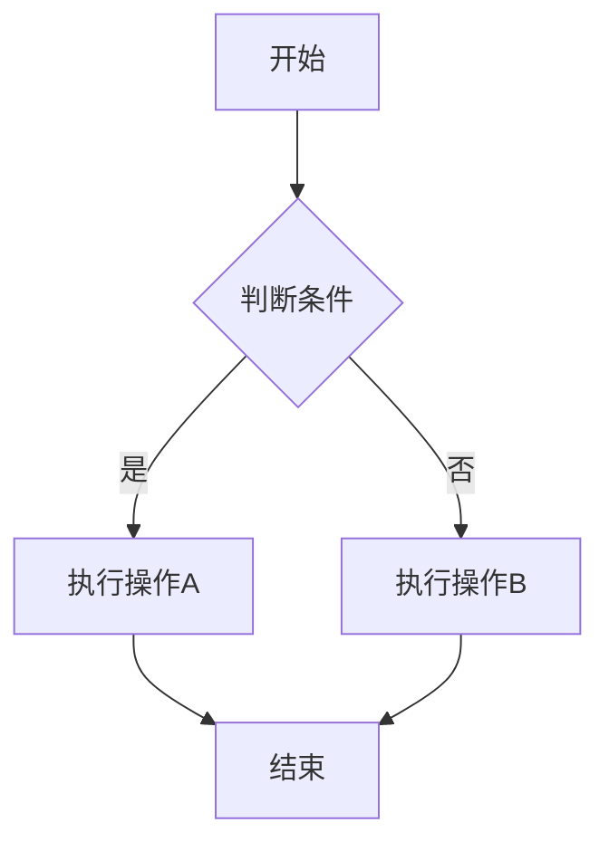
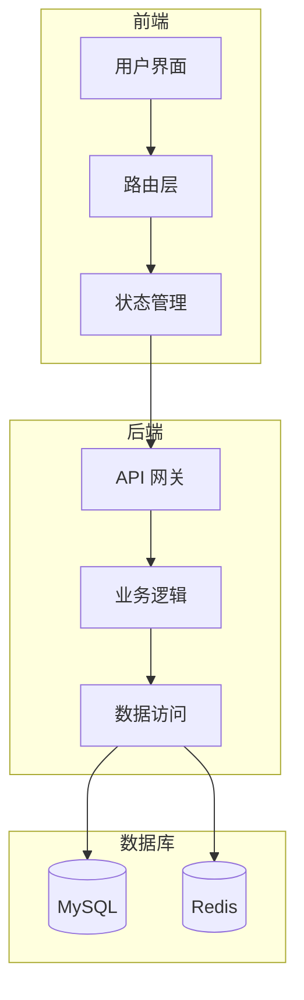
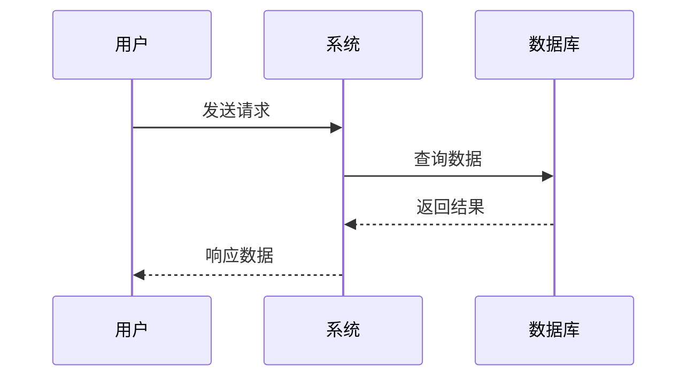
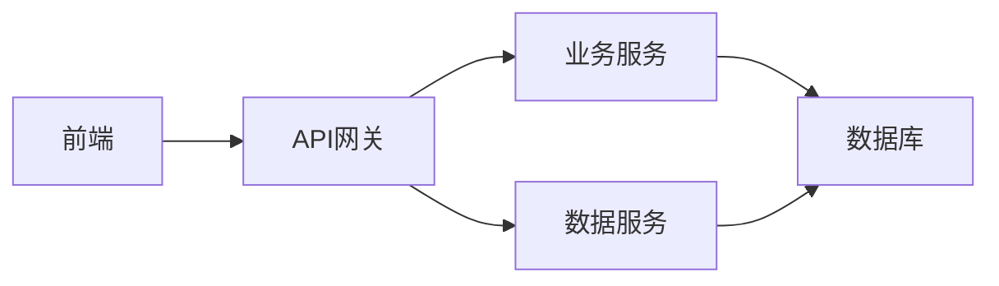

# Markdown to PPT 功能测试文档

## 1. 基础文本格式测试

### 1.1 内联格式

这是一段包含 **加粗文本**、*斜体文本*、***加粗斜体*** 和 `行内代码` 的测试段落。

### 1.2 列表测试

#### 无序列表

- 第一级列表项 1
- 第一级列表项 2
   - 第二级列表项 2.1
   - 第二级列表项 2.2
- 第一级列表项 3

#### 有序列表

1. 编号列表项 1
2. 编号列表项 2
3. 编号列表项 3
   - 混合嵌套项 3.1
   - 混合嵌套项 3.2

---

## 2. 代码块测试

### 2.1 Python 代码

```python
def calculate_sum(a, b):
    """计算两个数的和"""
    result = a + b
    return result

# 测试函数
print(calculate_sum(10, 20))
```

### 2.2 JavaScript 代码

```javascript
function greet(name) {
    return `Hello, ${name}!`;
}

console.log(greet("World"));
```

---

## 3. 表格测试

### 3.1 简单表格

| 参数名称 | 类型 | 说明 |
|---------|------|------|
| input | String | 输入文件路径 |
| output | String | 输出文件路径 |
| layout | String | 布局类型 |

### 3.2 复杂表格

| 功能模块 | 实现状态 | 优先级 | 负责人 |
|---------|---------|--------|--------|
| 配置管理 | 已完成 | P0 | 张三 |
| 工具函数 | 已完成 | P0 | 李四 |
| 母版管理 | 已完成 | P1 | 王五 |
| Mermaid渲染 | 已完成 | P1 | 赵六 |
| 高度计算 | 已完成 | P2 | 钱七 |
| 布局引擎 | 已完成 | P0 | 孙八 |

### 3.3 表格内联格式测试

| 格式类型 | 示例内容 | 说明 |
|---------|---------|------|
| 加粗文本 | **重要** | 测试加粗 |
| 斜体文本 | *注意* | 测试斜体 |
| 加粗斜体 | ***警告*** | 测试加粗斜体 |
| 行内代码 | `code` | 测试代码 |
| 混合格式 | **测试** *斜体* `代码` | 测试混合 |

---

## 4. Mermaid 图表测试

### 4.1 简单流程图（应转为可编辑形状）


### 4.2 中等复杂度流程图（应转为可编辑形状）



### 4.3 复杂流程图（应使用 SVG 图片）



### 4.4 时序图（应转为可编辑形状或 SVG）



---

## 5. 多级标题测试

### 5.1 三级标题示例

#### 5.1.1 四级标题

这是四级标题下的内容。

##### 5.1.1.1 五级标题

这是五级标题下的内容，用于测试深层嵌套。

---

## 6. 长文本分页测试

### 6.1 长段落

这是一个很长的段落，用于测试自动分页功能。在实际使用中，当内容超过单页高度限制时，系统应该自动创建新的幻灯片。这个功能对于处理大量文本内容非常重要。

系统会根据内容的实际高度进行智能分页，确保每一页的内容都不会溢出边界。同时，系统还会保持标题的连续性，让读者能够清楚地知道当前内容属于哪个章节。

### 6.2 长列表

- 列表项 1：这是一个较长的列表项，包含了详细的说明文字
- 列表项 2：另一个长列表项，用于测试换行和高度计算
- 列表项 3：继续添加更多内容
- 列表项 4：测试多行文本的处理
- 列表项 5：验证列表的分页功能
- 列表项 6：确保所有内容都能正确显示
- 列表项 7：最后一个测试项

---

## 7. 混合内容测试

### 7.1 文本 + 代码 + 列表

这是一段说明文字，下面是代码示例：

```python
class TestClass:
    def __init__(self):
        self.value = 0

    def increment(self):
        self.value += 1
```

关键要点：

1. 代码应该保持正确的缩进
2. 语法高亮应该正常工作
3. 代码块不应该被截断

### 7.2 表格 + Mermaid

下面是系统架构：



对应的服务清单：

| 服务名称 | 端口 | 状态 |
|---------|------|------|
| 前端服务 | 3000 | 运行中 |
| API网关 | 8080 | 运行中 |
| 业务服务 | 8081 | 运行中 |
| 数据服务 | 8082 | 运行中 |

---

## 8. 特殊字符测试

### 8.1 转义字符

这里测试转义：\*不是斜体\*，\`不是代码\`，\[不是链接\]

### 8.2 中英文混排

This is English text mixed with 中文文本，用于测试 CJK 字符的处理和宽度计算。

---

## 9. 边界情况测试

### 9.1 空内容

### 9.2 单行内容

这是一个单行测试。

### 9.3 超长单词

Thisisaverylongwordwithoutanyspacestotestthewrappingfunctionality

---

## 10. 总结

本测试文档覆盖了以下功能点：

1. ✓ 基础文本格式（加粗、斜体、代码）
2. ✓ 列表（有序、无序、嵌套）
3. ✓ 代码块（多种语言）
4. ✓ 表格（简单、复杂）
5. ✓ Mermaid 图表（流程图、时序图）
   - ✓ SVG 矢量图渲染
   - ✓ 简单图表转可编辑形状
   - ✓ 复杂图表使用 SVG 图片
6. ✓ 多级标题（2-5级）
7. ✓ 长文本分页
8. ✓ 混合内容
9. ✓ 特殊字符处理
10. ✓ 边界情况

**预期覆盖度**: 约 75%（新增 SVG 可编辑功能测试）

**测试目标**: 验证所有核心功能正常工作，生成的 PPT 格式正确。

**SVG 可编辑测试说明**：
- 4.1 简单流程图：3个节点，应转为可编辑形状
- 4.2 中等复杂度流程图：5个节点，应转为可编辑形状
- 4.3 复杂流程图：包含子图，应使用 SVG 图片
- 4.4 时序图：根据复杂度自动判断

---

## 11. 引述测试

### 11.1 简单引述

> 这是一段简单的引述内容，用于测试基本功能。

### 11.2 多行引述

> 这是第一行引述内容。
> 这是第二行引述内容。
> 这是第三行引述内容，用于测试多行合并显示。

### 11.3 引述内联格式

> 这段引述包含 **加粗文本**、*斜体文本* 和 `行内代码`，用于测试内联格式的解析。

### 11.4 长引述（测试跨页）

> 这是一段较长的引述内容，用于测试跨页功能。当引述内容超过单页高度限制时，系统应该能够正确处理分页，确保内容完整显示。引述框的样式应该与代码块有所区别，使用浅蓝色背景和深蓝色边框，而代码块使用浅灰色背景和黑色边框。这样用户可以一眼区分出不同类型的内容块。
