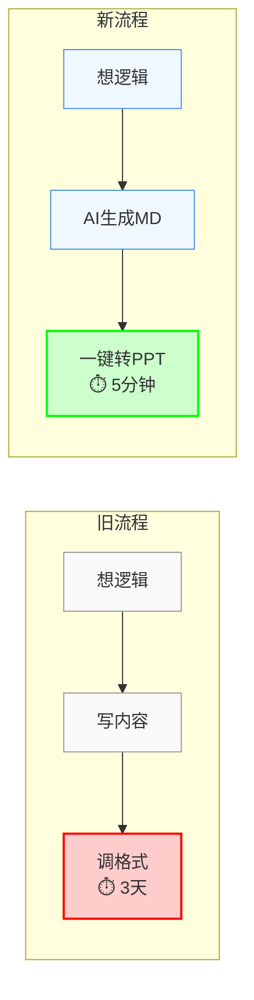
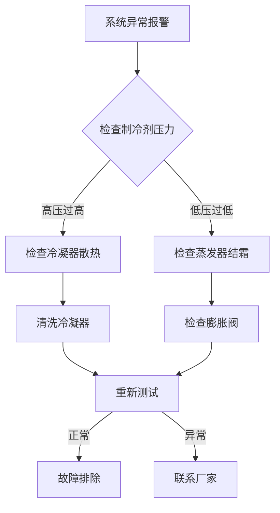
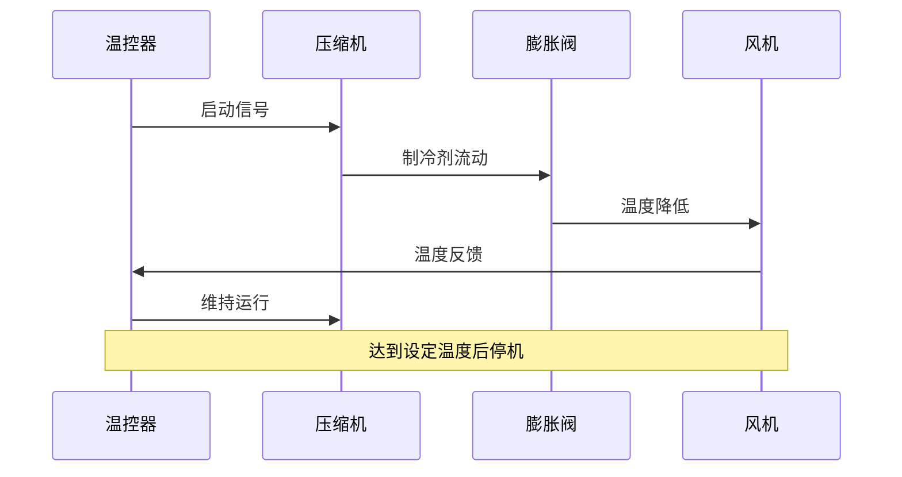
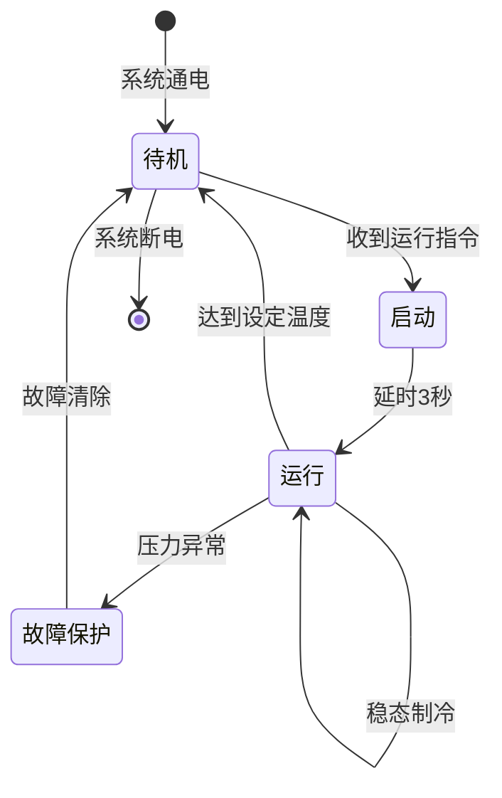
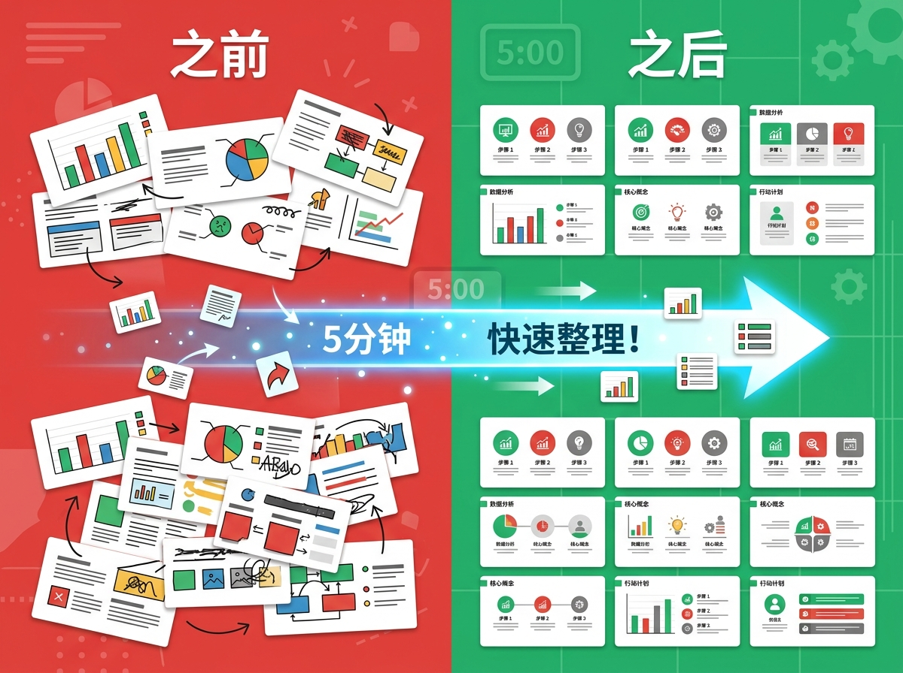

# 当制冷工程师学会用 AI：我用 AI 重构了技术规格书的工作流


## 痛点：300 页规格书的排版地狱

> "周五下午 3 点，我刚把第 287 页规格书的流程图对齐，领导说：'这部分要加一页测试方案，往后挪挪...'"

这是我去年最真实的工作场景。

作为制冷性能开发工程师，我几乎每个项目都要写技术规格书。一份规格书，动辄一两百页，多则三四百页。里面有参数对比表、系统流程图、热力学计算公式、测试方法代码块……

你以为我在写技术方案？不，我在做"格式工"。

每天大部分时间花在调整表格列宽、对齐流程图节点、统一字号和行距，还有在 PPT 里不停复制粘贴。

然后 AI 来了。我以为能解放双手，结果发现：AI 能写内容，但 PPT 格式是它的噩梦。

你让 AI 生成一份 300 页的技术规格书 PPT？它给你一堆格式混乱的幻灯片，调格式的时间比自己写还长。

这就是我遇到的四个痛点：

1. **格式黑洞** — 300 页规格书，调格式比写内容花时间
2. **AI 失效** — AI 能写内容，但直接输出 PPT 格式灾难
3. **逻辑迷失** — 忙着对齐、调字号，忘了自己到底要说什么
4. **修改地狱** — PPT 格式对修改极不友好
   - 插入一页内容？后面所有页码都要改
   - 更新目录？手动调整每一项
   - 调整模块关系？牵一发动全身

你哪怕只改一个小章节，都可能影响整个文档的结构。好不容易对齐的流程图、精心调整的表格列宽，一夜回到解放前。

---


---

## 转折：我意识到我在做"格式工"

某天深夜，我盯着第 156 页的流程图发呆。

我突然意识到：我在做一个"格式工"，不是工程师。

我的核心价值应该是业务逻辑、技术方案、系统设计。但每天 80% 的时间都在调格式。

能不能换个思路？

AI 擅长什么？生成结构化的 Markdown 内容。表格、列表、标题，它信手拈来。

什么格式是 PPT 的"规格书模板"？如果有一个固定模板，符合技术规格书的格式要求……

我的价值在哪里？想清楚业务逻辑、技术方案，让 AI 和工具帮我搞定格式。

于是有了新思路：中间层。



> 从 3 天到 5 分钟，中间层的价值

---

## 解决方案：Markdown 作为中间层

我写了一个 skill：Markdown 转 PPT 转换器。

这个 skill 可以被各种 AI Agent 调用 —— 无论是 Cursor、Claude Code，还是其他支持 skill 的工具。Agent 只需要生成 Markdown，skill 自动转换成符合规格书格式的 PPT。

核心思路很简单：AI 生成 Markdown → skill 转换成 PPT。

### 为什么选 Markdown？

Markdown 是 AI 时代的通用语言。结构化、纯文本，AI 最擅长处理。它天生就把内容和格式分开，又是技术文档的事实标准。

AI 写 Markdown 就像写文档一样自然，不用管 PPT 的排版细节。

**更重要的是：Markdown 对修改极度友好**

- 想插入内容？直接加段落，自动重新生成 PPT
- 要更新目录？标题变化自动同步
- 调整模块关系？移动章节即可，页面编号自动更新
- 版本控制友好？Git 追踪每一次修改，对比一目了然

你只需要维护一份 Markdown，随时修改、重新生成 PPT。再也不用因为插入一页内容而手动调整后面 100 页的格式。

### 技术规格书需要的，它都有

**Mermaid：用代码画图**

流程图、时序图、架构图，代码即图形。AI 能理解逻辑关系并生成代码，版本控制友好，修改不留痕迹。支持 7 种图表类型：流程图、时序图、类图、状态图、甘特图、饼图、思维导图。

**示例：制冷系统故障诊断流程**



**示例：温控器与制冷系统交互时序**



**示例：压缩机运行状态机**



---

**LaTeX：数学公式的标准**

技术规格书的必备能力。从计算公式到热力学方程，行业通用，专业表达。

**示例：增量型 PID 控制公式**

$$
\Delta u(k) = K_p [e(k) - e(k-1)] + K_i e(k) + K_d [e(k) - 2e(k-1) + e(k-2)]
$$

**示例：制冷循环性能系数 COP**

$$
COP = \frac{Q_e}{W_c} = \frac{h_1 - h_4}{h_2 - h_1}
$$

**示例：制冷量计算公式**

$$
Q_e = \dot{m} \cdot (h_1 - h_4) = \rho \cdot V \cdot (h_1 - h_4)
$$

**示例：理想制冷循环（卡诺循环）COP**

$$
COP_{Carnot} = \frac{T_e}{T_c - T_e} = \frac{T_L}{T_H - T_L}
$$

### 一行命令搞定

**基本用法：**

```bash
node scripts/md_to_ppt.js -i spec.md -o spec.pptx
```

就这么简单。当然，也支持更多选项：

**选项决策指引：**

| 场景                          | 推荐选项                                                 |
| ----------------------------- | -------------------------------------------------------- |
| 默认转换（无需任何额外选项）  | 直接 `-i` `-o` 即可                                  |
| 需要可编辑的 Mermaid 图表     | `--mermaid-format emf`（需安装 Inkscape）              |
| 横版演示（适合投影）          | `-l landscape`                                         |
| 竖版布局（适合打印/规格书）   | `-l portrait`                                          |
| 公式太小/太大                 | `--math-scale 3` 或 `--math-scale 1`（默认 2）       |
| Mermaid 图表太小/太大         | `--mermaid-scale 3` 或 `--mermaid-scale 1`（默认 2） |
| 无需 Mermaid 图表（加速转换） | `--no-mermaid`                                         |
| 无需数学公式                  | `--no-math`                                            |

**完整选项列表：**

| 选项                 | 简写   | 说明                         | 默认值       |
| -------------------- | ------ | ---------------------------- | ------------ |
| `--input`          | `-i` | 输入 markdown 文件（必需）   | -            |
| `--output`         | `-o` | 输出 pptx 文件（必需）       | -            |
| `--layout`         | `-l` | `portrait` / `landscape` | `portrait` |
| `--font`           | `-f` | 字体名称                     | 微软雅黑     |
| `--mermaid-format` | -      | `svg` / `emf` / `png`  | `svg`      |
| `--mermaid-scale`  | -      | Mermaid 渲染缩放             | `2`        |
| `--no-mermaid`     | -      | 禁用 Mermaid 渲染            | -            |
| `--no-math`        | -      | 禁用数学公式渲染             | -            |
| `--math-scale`     | -      | 公式渲染缩放比例             | `2`        |

> 一行命令，Markdown 变成 PPT

### 工具能做什么

| 能力       | 说明                                                 |
| ---------- | ---------------------------------------------------- |
| 一键转换   | 一行命令，Markdown → 规格书 PPT                     |
| 7 种图表   | 流程图、时序图、类图、状态图、甘特图、饼图、思维导图 |
| 数学公式   | LaTeX 公式自动渲染为 SVG                             |
| 表格排版   | 支持内联格式（加粗、斜体、代码）                     |
| 代码块高亮 | 灰底框，专业展示                                     |
| 引述框     | 蓝底 + 💡 图标，重点突出                             |
| 智能分页   | 内容过多自动新建页面                                 |
| 竖版/横版  | 适配不同输出需求                                     |

规格书必备元素全覆盖：参数对比表、系统流程图、计算公式、测试方法代码，一个不少。

---


---



---

## 效果对比：从 3 天到 5 分钟

真实数据说话：

| 维度     | 旧流程             | 新流程               |
| -------- | ------------------ | -------------------- |
| 耗时     | 3天                | 5分钟                |
| 聚焦     | 格式               | 业务逻辑             |
| 修改成本 | 高（牵一发动全身） | 低（改 MD 重新生成） |
| 格式统一 | 靠手动             | 模板自动             |

### 真实案例

某项目 100+ 页规格书，原计划 2 天排版，实际 5 分钟搞定，外加 1 小时内容优化。

更重要的是，我现在可以专注于系统架构设计、业务逻辑梳理、技术方案优化，而不是在 PPT 里对齐流程图。

---


---

## 思考：工具的价值不是让你做得更快

> "工具的价值不是让你做得更快，而是让你做得更对"

这是我做这个工具最大的收获。

AI 时代的工程师，应该从"格式工"变成"逻辑架构师"。工具链思维：找到 AI 的薄弱环节，用工具补上。

这个工具是我个人项目，但我相信它可以帮到更多工程师。项目即将开源，期待你的使用和建议。

## 结尾

如果你也是技术工程师，每天花大量时间写 PPT 格式的技术文档：

希望这个工具能帮你解放双手，让你专注于真正有价值的事情。

**GitHub: [链接即将更新]**

（项目即将开源，欢迎关注）

---

*作者：制冷性能开发工程师*
*工具：md-to-ppt — Markdown 转 PowerPoint 转换器*

---
